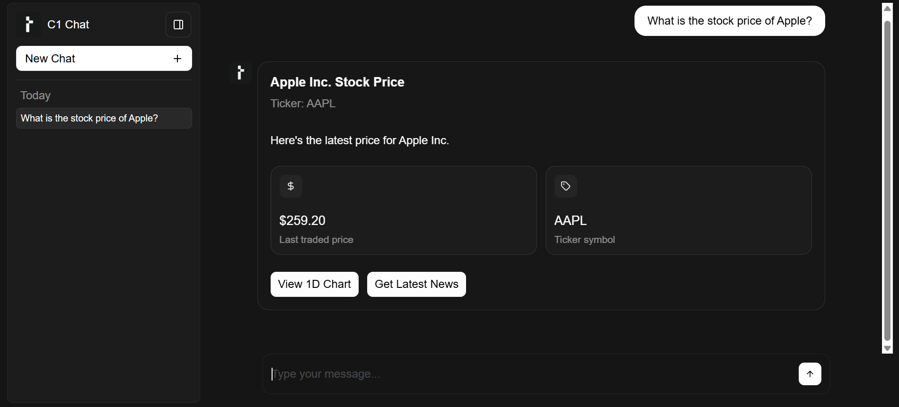
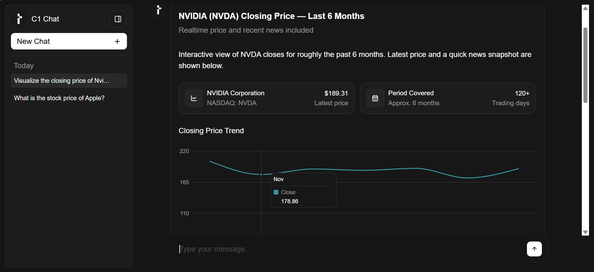
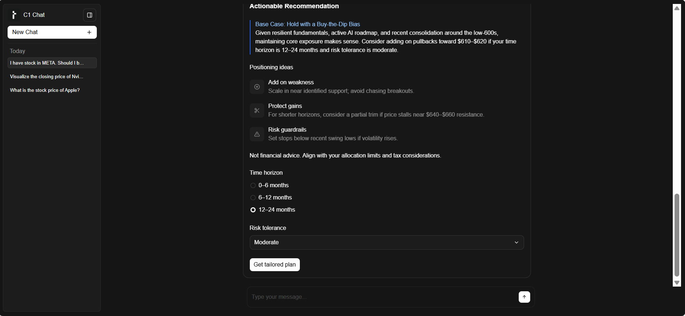
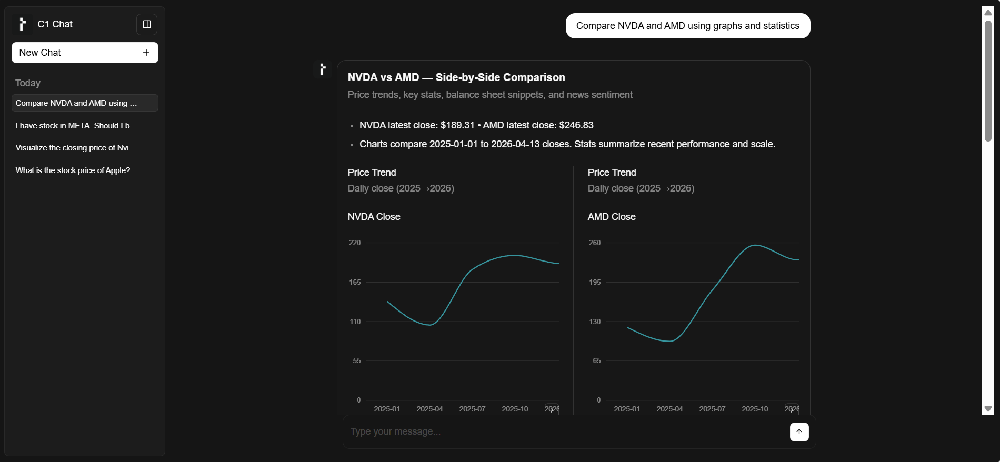

## AI Stock Analysis Assistant

An AI-powered stock analysis assistant built with FastAPI, LangChain, and yFinance. This project allows users to interact with stock market data through a conversational interface, combining real-time financial data retrieval with AI-generated insights.

## Screenshots

### Stock Price Lookup



### Historial Price Visualization



### AI-Based Recommendation



### Multi-Stock Comparison



## Features 

- Retrieve current stock prices
- View historical stock price data over a selected date range
- Access recent stock-related news
- View company balance sheet data
- Stream AI responses in real time
- Analyze stocks with technical indicators
- Generate AI-assisted stock recommendations

## Tech Stack

Frontend:

- React
- Vite
- Thesys GenUI SDK
- TypeScript

Backend: 

- FastAPI
- Python
- Uvicorn
- yFinance (financial data)

AI / Agent Framework:

- LangChain
- Thesys LLM API

## Installation & Setup

### 1. Clone the Repository

```bash
git clone https://github.com/PrincewillEke/AI-Stock-Analysis-Assistant.git
cd ai-stock-analysis-assistant
```

### 2. Backend Setup

```bash
cd backend
uv sync
uv run python main.py
```

Create a .env file inside the backend folder:
In the .env file: 

OPENAI_API_KEY=your_api_key_here

Backend runs at: http://localhost:8888

### 3. Frontend setup

```bash
cd frontend
npm install
npm run dev
```

Frontend runs at: http://localhost:5173

## Example Prompts 

Try asking:
- What is the current stock price of AAPL?
- Visualize the closing prise of Tesla over the last 6 months.
- Show me recent news about NVIDIA.
- Compare NVIDIA and AMD using graphs and statistics. 
- Should I buy, sell, or hold Amazon stock?


